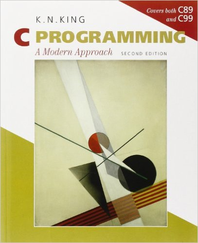

# C_Programming_A_modern_approch_-solutions
My ***solutions*** to the exercises in K. N. King's "C Programming: A
Modern Approach", second edition. "

##Informations
All testing was done on Linux system running GCC 11.4.0. 
To check your current gcc version used, enter the following command:
'''bash
gcc --version
'''
